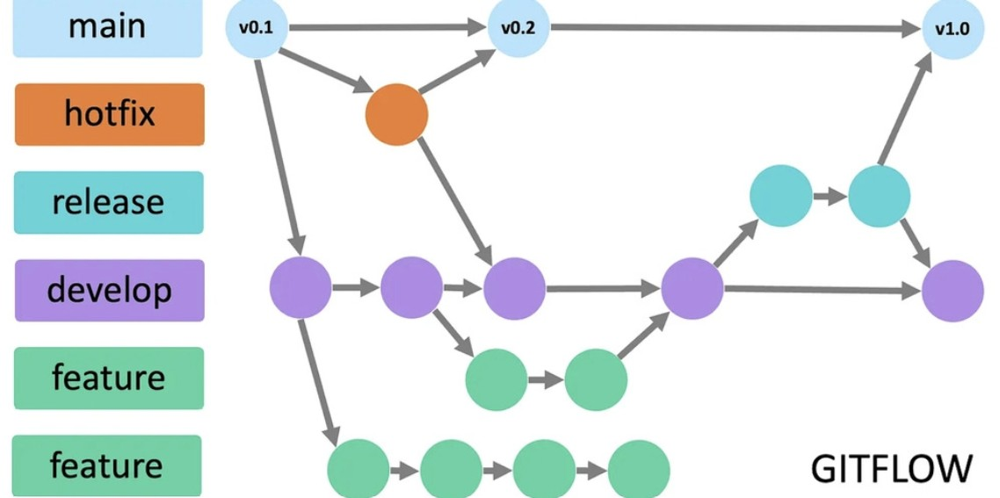
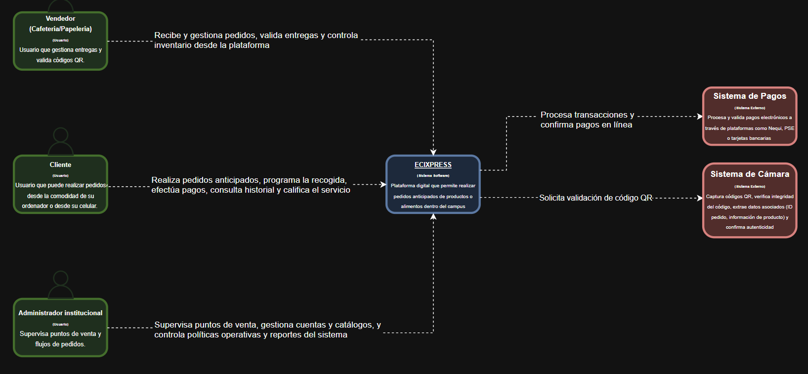
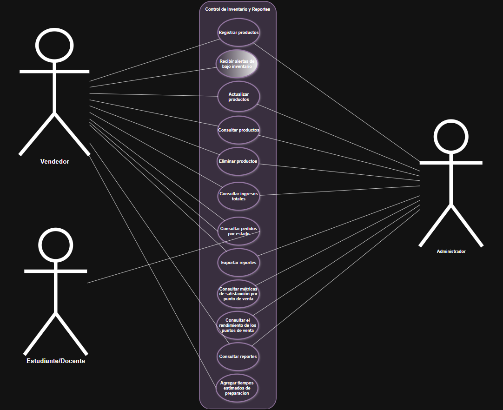
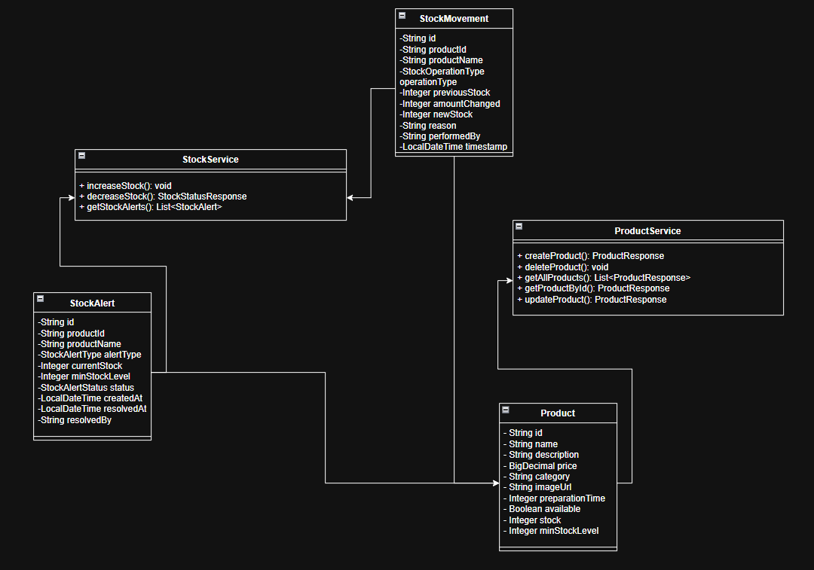
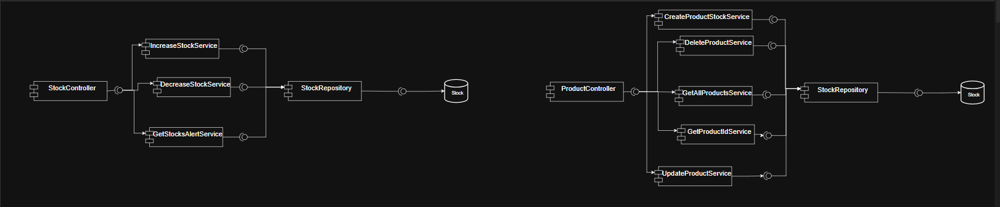
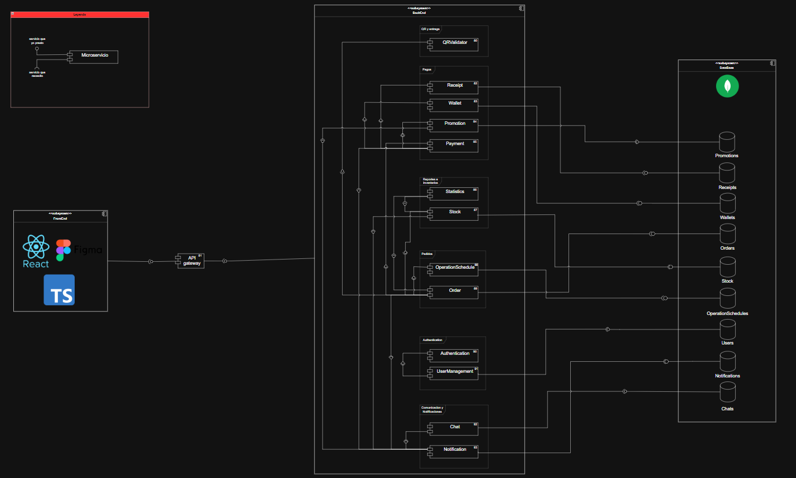
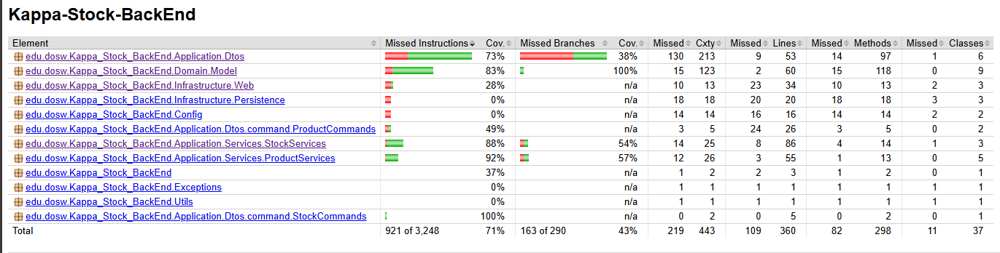
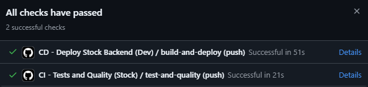

[](https://ECIEXPRESS-backend-api.azurewebsites.net/actuator/health)


# 📚 ECIEXPRESS

> <b>Gestionamiento de compras en papelerias y cafeterias</b>

---

## 📑 Tabla de Contenidos

1. 👤 [Integrantes](#1--integrantes)
2. 📦 [Microservicio de Stock](#2--objetivo-del-proyecto)
3. ⚡ [Funcionalidades principales](#3--funcionalidades-principales)
4. 📋 [Manejo de Estrategia de versionamiento y branches](#4--manejo-de-estrategia-de-versionamiento-y-branches)
    - 4.1 [Convenciones para crear ramas](#41-convenciones-para-crear-ramas)
    - 4.2 [Convenciones para crear commits](#42-convenciones-para-crear-commits)
5. ⚙️ [Tecnologías utilizadas](#5--tecnologias-utilizadas)
6. 🧩 [Funcionalidad](#6--funcionalidad)
7. 📊 [Diagramas](#7--diagramas)
    - 7.1 🟩 [Diagrama de Contexto](#71--diagrama-de-contexto)
    - 7.2 🟦 [Diagrama de Casos de Uso](#72--diagrama-de-casos-de-uso)
    - 7.3 🟨 [Diagrama de Clases](#73--diagrama-de-clases)
    - 7.4 🟥 [Diagrama de Componentes — General](#74--diagrama-de-componentes--general)
    - 7.5 🟨 [Diagrama de Componentes — Específico (Backend)](#75--diagrama-de-componentes--especifico-backend)
    - 7.6 🟩 [Diagrama de Base de Datos (MongoDB)](#76--diagrama-de-base-de-datos-mongodb)
    - 7.7 🛰️ [Diagrama de Despliegue](#77--diagrama-de-despliegue)
8. 🌐 [Endpoints expuestos y su información de entrada y salida](#8--endpoints-expuestos-y-su-informacion-de-entrada-y-salida)
9. ⚠️ [Manejo de Errores](#9--manejo-de-errores)
10. 🧪 [Evidencia de las pruebas y cómo ejecutarlas](#10--evidencia-de-las-pruebas-y-como-ejecutarlas)
11. 🗂️ [Código de la implementación organizado en las respectivas carpetas](#11--codigo-de-la-implementacion-organizado-en-las-respectivas-carpetas)
12. 📝 [Código documentado](#12--codigo-documentado)
13. 🧾 [Pruebas coherentes con el porcentaje de cobertura expuesto](#13--pruebas-coherentes-con-el-porcentaje-de-cobertura-expuesto)
14. 🚀 [Ejecución del Proyecto](#14--ejecucion-del-proyecto)
15. ☁️ [Evidencia de CI/CD y Despliegue en Azure](#15--evidencia-de-cicd-y-despliegue-en-azure)
16. 🤝 [Contribuciones y agradecimientos](#16--contribuciones-y-agradecimientos)


---

## 1. 👤 Integrantes:

- Daniel Rodríguez
- Julián Arenas
- Belén Quintero
- Marlio Charry
- Juan Pablo Contreras

## 2. 📦 Microservicio de Stock

Este repositorio contiene el microservicio responsable de gestionar el inventario (stock) de productos para la plataforma EciExpress. Provee APIs para consultar niveles de stock, reservar y liberar unidades, registrar
entradas/salidas y obtener reportes históricos del inventario. Está diseñado para integrarse detrás de una API
Gateway y comunicarse con otros microservicios (pedidos, facturación, catálogo) mediante eventos o llamadas REST.

---

## 3. ⚡ Funcionalidades principales

Este microservicio centraliza la lógica de inventario:

- Mantener el nivel de unidades disponibles por producto.
- Soportar reservas temporales (ej. para procesos de checkout) con TTL y liberación automática o manual.
- Registrar movimientos de stock (entrada, salida, ajuste) para auditoría.
- Exponer reportes de disponibilidad y rotación de inventario.

## 4. 📋 Manejo de Estrategia de versionamiento y branches

### Estrategia de Ramas (Git Flow)



### Ramas y propósito
- Manejaremos GitFlow, el modelo de ramificación para el control de versiones de Git

#### `main`
- **Propósito:** rama **estable** con la versión final (lista para demo/producción).
- **Reglas:**
    - Solo recibe merges desde `release/*` y `hotfix/*`.
    - Cada merge a `main` debe crear un **tag** SemVer (`vX.Y.Z`).
    - Rama **protegida**: PR obligatorio, 1–2 aprobaciones, checks de CI en verde.

#### `develop`
- **Propósito:** integración continua de trabajo; base de nuevas funcionalidades.
- **Reglas:**
    - Recibe merges desde `feature/*` y también desde `release/*` al finalizar un release.
    - Rama **protegida** similar a `main`.

#### `feature/*`
- **Propósito:** desarrollo de una funcionalidad, refactor o spike.
- **Base:** `develop`.
- **Cierre:** se fusiona a `develop` mediante **PR**


#### `release/*`
- **Propósito:** congelar cambios para estabilizar pruebas, textos y versiones previas al deploy.
- **Base:** `develop`.
- **Cierre:** merge a `main` (crear **tag** `vX.Y.Z`) **y** merge de vuelta a `develop`.
- **Ejemplo de nombre:**  
  `release/1.3.0`

#### `hotfix/*`
- **Propósito:** corregir un bug **crítico** detectado en `main`.
- **Base:** `main`.
- **Cierre:** merge a `main` (crear **tag** de **PATCH**) **y** merge a `develop` para mantener paridad.
- **Ejemplos de nombre:**  
  `hotfix/fix-blank-screen`, `hotfix/css-broken-header`


---

### 4.1 Convenciones para **crear ramas**

#### `feature/*`
**Formato:**
```
feature/[nombre-funcionalidad]-ECIEXPRESS_[codigo-jira]
```

**Ejemplos:**
- `feature/readme_ECIEXPRESS-34`

**Reglas de nomenclatura:**
- Usar **kebab-case** (palabras separadas por guiones)
- Máximo 50 caracteres en total
- Descripción clara y específica de la funcionalidad
- Código de Jira obligatorio para trazabilidad

#### `release/*`
**Formato:**
```
release/[version]
```
**Ejemplo:** `release/1.3.0`

#### `hotfix/*`
**Formato:**
```
hotfix/[descripcion-breve-del-fix]
```
**Ejemplos:**
- `hotfix/corregir-pantalla-blanca`
- `hotfix/arreglar-header-responsive`

---

### 4.2 Convenciones para **crear commits**

#### **Formato:**
```
[codigo-jira] [tipo]: [descripción específica de la acción]
```

#### **Tipos de commit:**
- `feat`: Nueva funcionalidad
- `fix`: Corrección de errores
- `docs`: Cambios en documentación
- `style`: Cambios de formato/estilo (espacios, punto y coma, etc.)
- `refactor`: Refactorización de código sin cambios funcionales
- `test`: Agregar o modificar tests
- `chore`: Tareas de mantenimiento, configuración, dependencias

#### **Ejemplos de commits específicos:**
```bash
# ✅ BUENOS EJEMPLOS
git commit -m "26-feat: agregar validación de email en formulario login"
git commit -m "24-fix: corregir error de navegación en header mobile"


# ❌ EVITAR 
git commit -m "23-feat: agregar login"
git commit -m "24-fix: arreglar bug"

```

#### **Reglas para commits específicos:**
1. **Un commit = Una acción específica**: Cada commit debe representar un cambio lógico y completo
2. **Máximo 72 caracteres**: Para que sea legible en todas las herramientas Git
3. **Usar imperativo**: "agregar", "corregir", "actualizar" (no "agregado", "corrigiendo")
4. **Ser descriptivo**: Especificar QUÉ se cambió y DÓNDE
5. **Commits frecuentes**: Mejor muchos commits pequeños que pocos grandes

#### **Beneficios de commits específicos:**
- 🔄 **Rollback preciso**: Poder revertir solo la parte problemática
- 🔍 **Debugging eficiente**: Identificar rápidamente cuándo se introdujo un bug
- 📖 **Historial legible**: Entender la evolución del código
- 🤝 **Colaboración mejorada**: Reviews más fáciles y claras


---


## 5. ⚙️Tecnologías utilizadas

El backend del microservicio de stock de la plataforma EciExpress fue desarrollado con una arquitectura basada en **Spring Boot** y componentes del ecosistema **Java**, garantizando modularidad, mantenibilidad, seguridad y facilidad de despliegue.  
A continuación se detallan las principales tecnologías empleadas en el proyecto:

| **Tecnología / Herramienta** | **Versión / Framework** | **Uso principal en el proyecto** |
|------------------------------|--------------------------|----------------------------------|
| **Java OpenJDK** | 17 | Lenguaje de programación base del backend, orientado a objetos y multiplataforma. |
| **Spring Boot** | 3.x | Framework principal para la creación del API REST, manejo de dependencias e inyección de componentes. |
| **Spring Web** | — | Implementación del modelo MVC y exposición de endpoints REST. |
| **Spring Security** | — | Configuración de autenticación y autorización de usuarios mediante roles y validación de credenciales. |
| **Spring Data MongoDB** | — | Integración con la base de datos NoSQL MongoDB mediante el patrón Repository. |
| **MongoDB Atlas** | 6.x | Base de datos NoSQL en la nube utilizada para almacenar las entidades del sistema. |
| **Apache Maven** | 3.9.x | Gestión de dependencias, empaquetado del proyecto y automatización de builds. |
| **Lombok** | — | Reducción de código repetitivo con anotaciones como `@Getter`, `@Setter`, `@Builder` y `@AllArgsConstructor`. |
| **JUnit 5** | — | Framework para pruebas unitarias que garantiza el correcto funcionamiento de los servicios. |
| **Mockito** | — | Simulación de dependencias para pruebas unitarias sin requerir acceso a la base de datos real. |
| **JaCoCo** | — | Generación de reportes de cobertura de código para evaluar la efectividad de las pruebas. |
| **SonarQube** | — | Análisis estático del código fuente y control de calidad para detectar vulnerabilidades y malas prácticas. |
| **Swagger (OpenAPI 3)** | — | Generación automática de documentación y prueba interactiva de los endpoints REST. |
| **Docker** | — | Contenerización del servicio para garantizar despliegues consistentes en distintos entornos. |
| **Azure App Service** | — | Entorno de ejecución en la nube para el despliegue automático del backend. |
| **Azure DevOps** | — | Plataforma para la gestión ágil del proyecto, seguimiento de tareas y control de versiones. |
| **GitHub Actions** | — | Configuración de pipelines de integración y despliegue continuo (CI/CD). |
| **SSL / HTTPS** | — | Implementación de certificados digitales para asegurar la comunicación entre cliente y servidor. |

> 🧠 Estas tecnologías fueron seleccionadas para asegurar **escalabilidad**, **modularidad**, **seguridad**, **trazabilidad** y **mantenibilidad** del sistema, aplicando buenas prácticas de ingeniería de software y estándares de desarrollo moderno.


## 6. 🧩 Funcionalidad

A continuación se describen con detalle las funcionalidades que ofrece el microservicio de stock y el comportamiento esperado de cada una:

- **Consulta de stock por producto**:
    - Endpoint: `GET /api/v1/stock/{productId}`.
    - Descripción: Devuelve el estado actual del inventario para un producto: unidades disponibles (`available`), reservadas (`reserved`) y total (`total`).
    - Uso: Lecturas rápidas y cacheables para mostrar disponibilidad en el catálogo o durante checkout.

- **Reserva de unidades (locking lógico)**:
    - Endpoint: `POST /api/v1/stock/reserve`.
    - Descripción: Reserva N unidades para un `reservationId` único (idempotencia) asociado a un `orderId` o flujo de checkout. Se decrementa `available` y aumenta `reserved` hasta que se confirme o expire.
    - Reglas: Validaciones de cantidad, control de over-reservation y retorno de estado claro (`reserved` / `insufficient_stock`).

- **Liberación de reserva**:
    - Endpoint: `POST /api/v1/stock/release`.
    - Descripción: Libera una reserva por `reservationId` (por cancelación, expiración o rollback). Restaura `available` y decrementa `reserved` de forma idempotente.
    - TTL: Las reservas pueden expirar automáticamente tras `ttlSeconds`; el servicio puede ejecutar un job de limpieza o usar Redis con expiración.

- **Confirmación/consumo de stock (checkout final)**:
    - Comportamiento: Cuando un pedido se confirma, la reserva se transforma en consumo real: `reserved` decrementa y `total` / movimientos reflejan la salida (`OUT`).
    - Integración: Emitir evento `stock.consumed` o registrar un `StockMovement` de tipo `OUT` para trazabilidad.

- **Registro de movimientos (IN / OUT / ADJUST)**:
    - Endpoint: `POST /api/v1/stock/movement`.
    - Descripción: Registrar entradas (recepciones), salidas (consumos) y ajustes manuales por inventario. Cada movimiento genera un registro de auditoría con `movementId`, `reason` y `performedBy`.
    - Uso: Ajustes de inventario, recepciones de proveedores, devoluciones.

- **Reportes históricos y rotación**:
    - Endpoint: `GET /api/v1/stock/report?from=&to=`.
    - Descripción: Agregados y listados de movimientos por producto, periodos y métricas de rotación (ej. días de inventario, velocidad de venta).
    - Salida: Datos que permiten construir CSV/Excel y dashboards.

- **Exportación de datos**:
    - Funcionalidad: Permitir exportar reportes a CSV/Excel desde el payload JSON devuelto o mediante job asíncrono que genere y exponga un enlace de descarga.
---

## 7. 📊 Diagramas

### 7.1 Diagrama de Contexto




### 7.2 Diagrama de Casos de Usos



### 7.3 Diagrama de Clases



### 7.4 Diagrama de Componentes Específico



### 7.5 Diagrama de Componentes General




## 9. ⚠️ Manejo de Errores

El backend de ECIEXPRESS implementa un **mecanismo centralizado de manejo de errores** que garantiza uniformidad, claridad y seguridad en todas las respuestas enviadas al cliente cuando ocurre un fallo.

Este sistema permite mantener una comunicación clara entre el backend y el frontend, asegurando que los mensajes de error sean legibles, útiles y coherentes, sin exponer información sensible del servidor.

---

### 🧠 Estrategia general de manejo de errores

El sistema utiliza una **clase global** que intercepta todas las excepciones lanzadas desde los controladores REST.  
A través de la anotación `@ControllerAdvice`, se centraliza el manejo de errores, evitando el uso repetitivo de bloques `try-catch` en cada endpoint.

Cada error se transforma en una respuesta **JSON estandarizada**, que mantiene un formato uniforme para todos los tipos de fallos.

**📋 Estructura del mensaje de error:**

```json
{
  "timestamp": "2025-10-28T10:30:00Z",
  "status": 404,
  "error": "Not Found",
  "message": "La materia con ID AYPR no existe.",
  "path": "/api/subjects/AYPR"
}
```

---

### ⚙️ Global Exception Handler

El **Global Exception Handler** es una clase con la anotación `@RestControllerAdvice` que captura y maneja todas las excepciones del sistema.  
Utiliza métodos con `@ExceptionHandler` para procesar errores específicos y devolver una respuesta personalizada acorde al tipo de excepción.

**✨ Características principales:**

- ✅ **Centraliza** la captura de excepciones desde todos los controladores
- ✅ **Retorna mensajes JSON consistentes** con el mismo formato estructurado
- ✅ **Asigna códigos HTTP** según la naturaleza del error (400, 404, 409, 500, etc.)
- ✅ **Define mensajes descriptivos** que ayudan tanto al desarrollador como al usuario
- ✅ **Mantiene la aplicación limpia**, eliminando bloques try-catch redundantes
- ✅ **Mejora la trazabilidad** y facilita la depuración en los entornos de prueba y producción

**🔄 Ejemplo conceptual de funcionamiento:**

Cuando se lanza una excepción del tipo `EntityNotFoundException`, el handler la intercepta y genera automáticamente una respuesta como:

```json
{
  "status": 404,
  "error": "Not Found",
  "message": "La materia con ID AYPR no existe.",
  "path": "/api/subjects/AYPR"
}
```

---

### 🧩 Validaciones en DTOs

Además del manejo global de errores, el sistema utiliza **validaciones automáticas** sobre los DTOs (Data Transfer Objects) para garantizar que los datos que llegan al servidor cumplan con las reglas de negocio antes de ejecutar cualquier lógica.

Estas validaciones se implementan mediante las anotaciones de **Javax Validation** y **Hibernate Validator**, como `@NotBlank`, `@NotNull`, `@Email`, `@Min`, `@Max`, entre otras.

**📝 Ejemplo de DTO con validaciones:**

```
Se va a ir actualizando

```

Si alguno de los campos no cumple las validaciones, se lanza automáticamente una excepción del tipo `MethodArgumentNotValidException`.  
Esta es capturada por el **Global Exception Handler**, que devuelve una respuesta JSON estandarizada con el detalle del campo inválido.

**⚠️ Ejemplo de respuesta ante error de validación:**

```

Se actualizara cuando se creen las clases

```

> 💡 Gracias a este mecanismo, se asegura que las peticiones erróneas sean detectadas desde el inicio, reduciendo fallos en capas más profundas como servicios o repositorios.

---

### 📊 Tipos de errores manejados

La siguiente tabla resume los principales tipos de excepciones manejadas en el sistema, junto con su respectivo código HTTP y un ejemplo de mensaje retornado:

| **Excepción** | **Código HTTP** | **Descripción del error** | **Ejemplo de mensaje** |
|---------------|-----------------|---------------------------|------------------------|
| `IllegalArgumentException` | `400 Bad Request` | Parámetros inválidos o peticiones mal estructuradas | *"El campo 'subjectId' no puede ser nulo."* |
| `MethodArgumentNotValidException` | `400 Bad Request` | Error de validación en un DTO o parámetro de entrada | *"El correo electrónico no cumple el formato válido."* |
| `EntityNotFoundException` | `404 Not Found` | El recurso solicitado no existe en la base de datos | *"La materia con ID AYPR no existe."* |
| `DuplicateKeyException` | `409 Conflict` | Intento de crear un registro que ya existe en MongoDB | *"El usuario ya se encuentra registrado."* |
| `AccessDeniedException` | `403 Forbidden` | Intento de acceder a un recurso sin permisos | *"Acceso denegado para el rol STUDENT."* |
| `Exception` | `500 Internal Server Error` | Error interno no controlado del servidor | *"Error inesperado del servidor."* |

---

### ✅ Beneficios del manejo centralizado

| **Beneficio** | **Descripción** |
|---------------|-----------------|
| 🎯 **Uniformidad** | Todas las respuestas de error tienen el mismo formato JSON |
| 🔧 **Mantenibilidad** | Agregar nuevas excepciones no requiere modificar cada controlador |
| 🔒 **Seguridad** | Oculta los detalles internos del servidor y evita exponer trazas del sistema |
| 📍 **Trazabilidad** | Cada error incluye información contextual (ruta y hora exacta) |
| 🤝 **Integración fluida** | Facilita la comunicación con el frontend y herramientas como Postman o Swagger |

---

> Gracias a este enfoque, el backend de ECIEXPRESS logra un manejo de errores **robusto**, **escalable** y **seguro**, garantizando una experiencia de usuario más confiable y profesional.

---


---

## 10. 🧪 Evidencia de las pruebas y cómo ejecutarlas



Para ejecutar

> mvn clean test

## 11. 🗂️ Código de la implementación organizado en las respectivas carpetas

El código del proyecto sigue una arquitectura en capas (Domain-Application-Infrastructure) y está organizado de la siguiente forma principal:

- src/main/java/edu/dosw/Kappa_Stock_BackEnd/
  - Domain/Model — Entidades del dominio (Product, StockAlert, StockMovement, enums, etc.)
  - Application/
    - Dtos — DTOs y comandos usados por los casos de uso
    - Ports — Interfaces de puertos (repositorios) para abstracción de persistencia
    - Services — Implementaciones de los casos de uso (CreateProductService, IncreaseStockService, etc.)
    - Services/*UseCases* — Definición de los casos de uso como interfaces
  - Infrastructure/
    - Persistence — Adaptadores para MongoDB (repositories / adapters)
    - Web — Controladores REST (ProductController, StockController, StockAlertController)
    - Config — Beans y configuración de la aplicación
  - Config — Configuración de beans y wiring central (BeanConfiguration)

- src/main/resources/ — configuración de Spring (application.properties), mensajes y assets
- src/test/java/ — pruebas unitarias e integración organizadas en paquetes paralelos a src/main
- docs/ — diagramas, imágenes y documentación adicional (diagrama de contexto, casos de uso, jacoco, etc.)

Consejos para navegar el repo:
- Buscar los casos de uso en Application/Services para entender la lógica de negocio.
- Revisar Infrastructure/Persistence para ver cómo se mapea con MongoDB.
- Las pruebas están en src/test/java y sirven como ejemplos de uso de los servicios.

---

## 12. 📝 Código documentado

El proyecto incluye documentación inline y comentarios donde la lógica lo requiere, además de estar preparado para generar documentación adicional:

- OpenAPI / Swagger: la API REST está documentada con anotaciones (Swagger/OpenAPI).

**Cómo generar documentación locamente:**

- Swagger UI en tiempo de ejecución:

  Ejecutar la aplicación y acceder a: http://localhost:8080/swagger-ui.html o la ruta configurada por springdoc.

- docs/imagenes/SwaggerUI.png — captura de Swagger UI en ejecución.

---

## 13. 🧾 Pruebas coherentes con el porcentaje de cobertura expuesto

Se emplea JUnit 5 y Mockito para pruebas unitarias; JaCoCo genera el reporte de cobertura.

- Ejecutar pruebas y generar reporte de cobertura:

  >mvn clean test

  El reporte de Jacoco (HTML) se genera en: target/site/jacoco/index.html

- Estructura de pruebas relevantes:
  - src/test/java/.../Domain — pruebas unitarias de modelos (ProductTest, StockAlertTest, StockMovementTest)
  - src/test/java/.../Application/Services — pruebas unitarias de servicios (CreateProductServiceTest, Increase/DecreaseStockServiceTest, etc.)
  - src/test/java/.../Infrastructure/Web — pruebas de controladores con MockMvc (unitarias) e integración (Testcontainers, deshabilitadas localmente si Docker no está disponible)

- Nota sobre la cobertura mostrada en la cabecera: el porcentaje proviene del reporte JaCoCo integrado en el pipeline; si deseas actualizar la métrica localmente, abre el archivo HTML indicado después de ejecutar los tests.


---

## 14. 🚀 Ejecución del Proyecto

Requisitos previos:
- Java 17
- Maven 3.8+ (o 3.9+)
- MongoDB local o conexión a MongoDB Atlas (opcional: Docker para pruebas de integración)

Ejecución local (modo desarrollo):

1. Configurar variables / application.properties si usas MongoDB distinto al configurado por defecto.
2. Ejecutar con Maven:

  > mvn spring-boot:run

  o generar jar y ejecutar:

  > mvn clean package
>
  > java -jar target/*.jar

- Endpoints por defecto estarán expuestos en: http://localhost:8080/api/
- Swagger UI: http://localhost:8080/swagger-ui.html (si springdoc está activo)

Ejecución con Docker (opcional):

1. Construir la imagen:

  > docker build -t eciexpress-stock:latest .

2. Ejecutar (asegurarse de apuntar a una instancia de MongoDB válida):

  > docker run -e SPRING_DATA_MONGODB_URI="mongodb://host:27017/stock-db" -p 8080:8080 eciexpress-stock:latest

---

## 15. ☁️ Evidencia de CI/CD y Despliegue en Azure

La integración continua y despliegue se manejan mediante GitHub Actions y despliegues automáticos a Azure App Service (o slot configurado). El pipeline realiza:

- Compilación del proyecto y ejecución de pruebas (mvn test)
- Análisis de calidad (SonarQube) y reporte de cobertura (JaCoCo)
- Construcción de imagen Docker y push (si aplica)
- Despliegue a Azure App Service con credenciales seguras gestionadas por secrets de GitHub

Archivos y puntos de interés:
- .github/workflows/ci-cd.yml — flujo principal de CI/CD
- Azure Portal — App Service asociado al repositorio (configurada mediante GitHub Actions)



---

## 16. 🤝 Contribuciones y agradecimientos

El desarrollo del backend de ECIEXPRESS se realizó aplicando la **metodología ágil Scrum**, promoviendo la colaboración, la mejora continua y la entrega incremental de valor.  
Durante el proceso, el equipo KAPPA trabajó en **sprints semanales**, realizando **revisiones de avance**, **dailies** y **retrospectivas**, lo que permitió mantener una comunicación fluida y adaptarse a los cambios de requisitos en tiempo real.

Cada miembro del equipo asumió un rol dentro del marco de Scrum:

| **Rol Scrum** | **Responsabilidad principal** |
|----------------|-------------------------------|
| **Product Owner** | Definir y priorizar las historias de usuario en el backlog del producto. |
| **Scrum Master** | Asegurar la aplicación de la metodología y eliminar impedimentos. |
| **Developers** | Diseñar, implementar, probar y documentar las funcionalidades. |

**Artefactos y eventos Scrum utilizados:**
- 📋 **Product Backlog:** listado de funcionalidades priorizadas y mantenidas en Jira/GitHub Projects.
- 🧩 **Sprint Backlog:** tareas seleccionadas por sprint según la capacidad del equipo.
- ⚙️ **Daily Scrum:** reuniones cortas de sincronización para identificar bloqueos y avances.
- 📦 **Sprint Review:** revisión de resultados y demostración del incremento funcional.
- 🔄 **Sprint Retrospective:** análisis de mejoras en la dinámica y la comunicación del equipo.

> 💡 Gracias al uso de Scrum, el desarrollo de KAPPA se mantuvo **organizado, transparente y enfocado en la entrega continua de valor**, aplicando principios de autoorganización y aprendizaje colaborativo.

## 🤝 Contribuciones y mantenimiento

**Desarrollado por el equipo KAPPA – DOSW 2025-2**

### 🙌 ¡Gracias por visitar ECIEXPRESS!

- Si tienes sugerencias, encuentras errores o deseas aportar nuevas funcionalidades, ¡las contribuciones son bienvenidas!
- Puedes abrir un **issue** o enviar un **pull request** siguiendo las buenas prácticas de colaboración del repositorio.

> 💡 **ECIEXPRESS** es un proyecto académico, pero su arquitectura y calidad están pensadas para ser escalables y adaptables a escenarios reales en instituciones educativas.

---

### 🚀 ECIEXPRES nació como una idea para optimizar los procesos académicos y terminó convirtiéndose en un proyecto que combina tecnología, trabajo en equipo y propósito!

---

